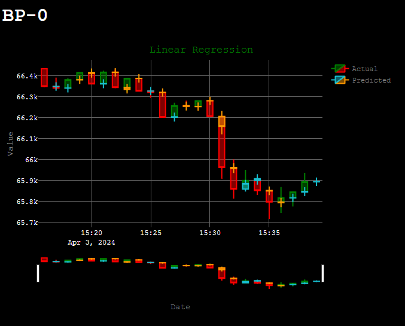

# BitcoinPredictor 📈

## Project Overview

The project aims to predict the price of Bitcoin over 1-minute candlesticks. Due to the lack of proper hardware, this is accomplished using supervised-learning methods only.

## Features

- **Live Price Prediction**: Predicts the close, low, & high aspects of the current 1-minute candlestick.
- **Web Interface**: Web interface that demonstrates the predictions and the actual values visually.
- **Multiprocessing**: Runs each model as a separate process to enhance efficiency and serve the live predictions in a timely fashion.
- **Multithreading**: API requests are ran in separate threads to save time.
- **Automatic Data Fetching**: Uses Kaggle's CroissantML format and other public APIs to automatically download and store the data in parquet format.
- **Web Scraping**: Utilizes a Socks-5 proxy through a local TOR browser instance to scrape live news from the DuckDuckGo.
- **Live Sentiment Analysis**: The scraped news articles are fed into [FinBERT](https://huggingface.co/ProsusAI/finbert) to get live sentiment.
- **Live Data Collection**: Live data is collected from various sources including Binance, CoinStats, & YahooFinanace.

## Data Sources

### Training Data

### Live Data

## Installation

1. You must have 
1. Create a `config.json` file in the root directory of the project. The structure of the file must match that of `example_config.json`.
2. [Optional] Create a virtual python environment and initialize it.
3. Install the project requirements by running the following command `pip install -r requirements.txt`.
    - Note that this project requires Python 3.11.8 and on some systems you must run `pip3 install -r requirements.txt`.

## Usage

1. Change into the project directory and start the server by `python .` or `python3 .`
2. Access the web interface at `http://127.0.0.1:{PORT FROM config.json}`.

## Examples

- This example uses the following [link](https://www.fxstreet.com/cryptocurrencies/news/top-3-price-prediction-bitcoin-ethereum-ripple-facing-correction-after-etfs-led-rally-202405300755): 

- This example uses the following [link](https://cointelegraph.com/news/bitcoin-etfs-traditional-finance-investments), which blocks the download:
  

- This example uses the following [link](https://www.coindesk.com/markets/2024/05/23/bitcoin-drops-below-68k-ether-slumps-in-sudden-crypto-sell-off-as-eth-etf-decision-looms/):

## License

MIT License

Copyright (c) 2024

Permission is hereby granted, free of charge, to any person obtaining a copy of this software and associated documentation files (the "Software"), to deal in the Software without restriction, including without limitation the rights to use, copy, modify, merge, publish, distribute, sublicense, and/or sell copies of the Software, and to permit persons to whom the Software is furnished to do so, subject to the following conditions:

The above copyright notice and this permission notice shall be included in all copies or substantial portions of the Software.

THE SOFTWARE IS PROVIDED "AS IS", WITHOUT WARRANTY OF ANY KIND, EXPRESS OR IMPLIED, INCLUDING BUT NOT LIMITED TO THE WARRANTIES OF MERCHANTABILITY, FITNESS FOR A PARTICULAR PURPOSE AND NONINFRINGEMENT. IN NO EVENT SHALL THE AUTHORS OR COPYRIGHT HOLDERS BE LIABLE FOR ANY CLAIM, DAMAGES OR OTHER LIABILITY, WHETHER IN AN ACTION OF CONTRACT, TORT OR OTHERWISE, ARISING FROM, OUT OF OR IN CONNECTION WITH THE SOFTWARE OR THE USE OR OTHER DEALINGS IN THE SOFTWARE.
